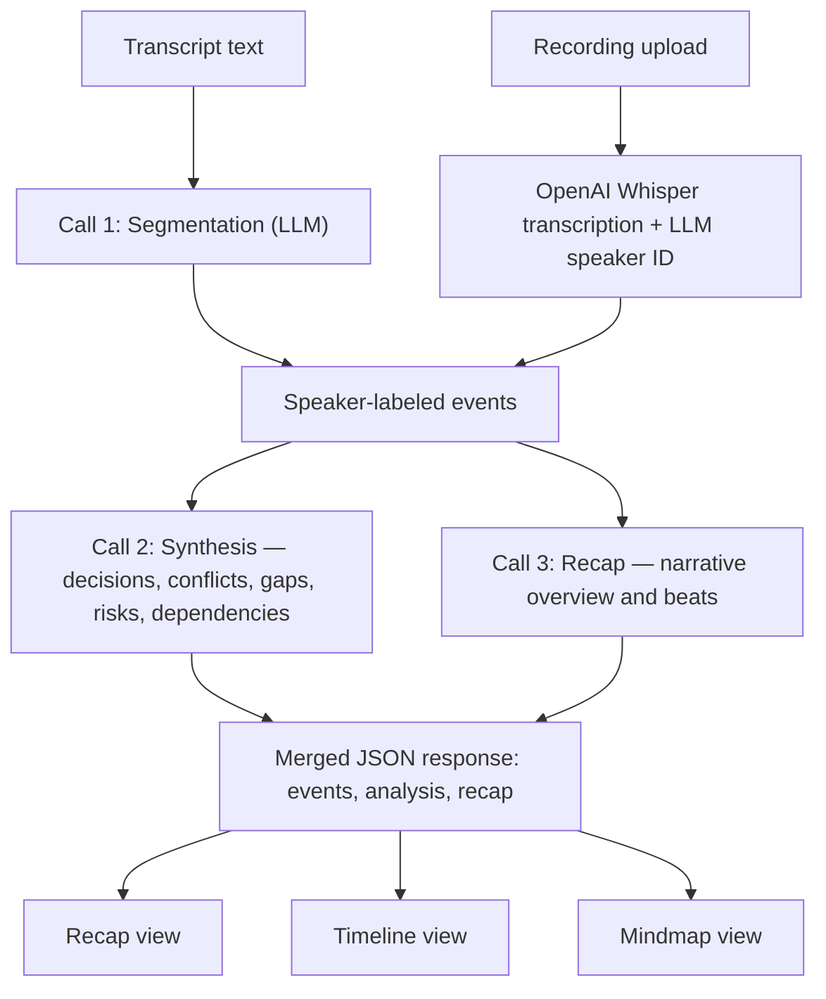

# Meeting Reality Engine

**Meetings don't fail because people forget what was said. They fail because nobody agrees on what was decided.**

[](https://www.python.org/)
[](https://fastapi.tiangolo.com/)
[](LICENSE)
[](https://openai.com/)

## What is this

Meeting Reality Engine turns a raw meeting transcript — or an uploaded recording — into evidence-grounded state: what was decided, what was committed, where people explicitly disagreed, and what was quietly left unresolved. Every claim it makes is traceable back to the exact line it came from; anything the model can't back up with real evidence is stripped out before it ever reaches the UI.

## Built at Astra Commons: Dhaka

This project was built during **Astra Commons: Dhaka**, a community meetup for developers, students, founders, and AI builders. The session centered on Codex, the GPT-6 Astra launch, and AI-assisted development workflows built on OpenAI's Developer Platform — this repo is a direct product of that hands-on session.

## Table of Contents

- [Features](#features)
- [Architecture](#architecture)
- [Tech Stack](#tech-stack)
- [Quick Start](#quick-start)
- [Project Structure](#project-structure)
- [Roadmap](#roadmap)
- [License](#license)
- [Acknowledgments](#acknowledgments)

## Features

- **Automatic conflict and gap detection.** Finds where two people said contradictory things and surfaces topics the transcript clearly implies matter but that never actually got resolved — categories a plain summarizer has no concept of.
- **State reconstruction, not summarization.** Every topic is classified as decided, committed, discussed, in conflict, or unresolved, each with a plain-language reason.
- **Plain-language Recap.** A separate, conversational "catch a coworker up" narrative — distinct in tone from the structured analysis — generated in parallel with it.
- **Recording upload with automatic transcription.** Drop in an mp4/audio file; OpenAI Whisper transcribes it automatically, and speakers are identified via LLM analysis. You can rename each speaker inline with a one-click audio preview of their actual first line.
- **Evidence panel on every claim.** Click any topic to see the full reasoning and the exact transcript lines it's grounded in — the same evidence view is reused for Recap beats.
- **Risks with ready-to-ask follow-ups.** Each flagged risk ships with a suggested question to ask next time, not just a warning.
- **Action Board.** A read-only summary of every committed item — owner, deadline (or an honest "No confirmed deadline"), and confidence.
- **Three result views.** Recap (narrative), Timeline (interactive state graph with dependencies), and Mindmap (radial topic overview) — all rendered from the same response, no extra fetches.

## Architecture



Segmentation (Call 1) always runs first and turns raw text into speaker-labeled events; an uploaded recording reaches that same event shape via OpenAI Whisper transcription and LLM-based speaker identification instead, skipping segmentation entirely. From there, synthesis (Call 2) and the recap (Call 3) run concurrently — both depend only on the segmented events, not on each other — and merge into one JSON response that the frontend renders into any of the three result views (Recap, Timeline, Mindmap) without a second fetch.

### API endpoints

| Endpoint | Method | Body | Returns |
|---|---|---|---|
| `/api/analyze` | POST | `{ transcript, title?, participants? }` | `{ events, analysis, recap }` — segments the transcript, then runs synthesis and recap in parallel. |
| `/api/analyze-events` | POST | `{ events, title?, participants? }` | `{ events, analysis }` — synthesizes pre-segmented, speaker-labeled events directly (used by the upload flow). |
| `/api/transcribe` | POST | `multipart/form-data`, field `file` | `{ events, speakers, duration_ms }` — transcribes with OpenAI Whisper and identifies speakers with LLM; speakers come back as `"User 1"`, `"User 2"`, ... in order of first appearance. |
| `/health` | GET | — | `{ status: "ok" }` |

`analysis` is always shaped as:

```ts
{
  meeting_state: { topic, status, value, owner, deadline, confidence, evidence_ids, reasoning }[],
  conflicts:     { topic, statement_a, statement_b }[],
  gaps:          { topic, why_it_matters, implied_by_evidence_ids }[],
  risks:         { statement, reason, suggested_followup_question, evidence_ids }[],
  dependencies:  { from_topic, to_topic, reason }[],
  summary_stats: { decisions, commitments, conflicts, gaps },
}
```

`recap` (nullable — see [Roadmap](#roadmap)) is shaped as `{ overview, beats: { text, related_topic, evidence_ids }[] }`.

## Tech Stack

| Layer | Technology |
|---|---|
| Backend | FastAPI, served with Uvicorn |
| LLM | [OpenAI API](https://openai.com/) using `gpt-3.5-turbo` |
| Speech-to-text | [OpenAI Whisper API](https://platform.openai.com/docs/guides/speech-to-text) |
| Speaker identification | LLM-based (OpenAI) |
| Frontend (working tool) | Vanilla HTML/CSS/JS — no build step |
| Frontend (marketing site) | Next.js 14, TypeScript, Tailwind CSS |

## Quick Start

1. **Clone the repository.**

   ```bash
   git clone https://github.com/Tayebbb/meeting-reality.git
   cd meeting-reality
   ```

2. **Install Python dependencies.**

   ```bash
   pip install -r requirements.txt
   ```

3. **Add your OpenAI API key to `.env`.**

   Copy `.env.example` to `.env` and fill in your API key:

   ```bash
   cp .env.example .env
   ```

   Then edit `.env`:

   ```env
   OPENAI_API_KEY=sk-your-actual-api-key-here
   ```

   - **OPENAI_API_KEY**: Get your API key from [OpenAI Platform](https://platform.openai.com/api-keys). This is required for all features (transcript analysis, transcription, and speaker identification).

4. **Run the server.**

   ```bash
   uvicorn main:app --reload
   ```

5. **Open it.** Go to [http://localhost:8000/static/](http://localhost:8000/static/), paste a transcript (or upload a recording), and hit **Analyze**.

**Cost note**: The app uses OpenAI's API, which is a paid service. Costs are low (roughly $0.01–$0.05 per analysis depending on transcript length and your OpenAI account's pricing tier), but you'll need an active OpenAI account with available credits.

## Project Structure

```
main.py                 FastAPI backend — segmentation, synthesis, recap, transcription
static/index.html       Working tool frontend (vanilla JS, no build step)
requirements.txt        Python dependencies

app/                     Next.js marketing site
  layout.tsx
  page.tsx
  globals.css

components/
  ui/                    Shared UI primitives (e.g. streaming-text.tsx)
  marketing/              Landing-page-specific components

lib/utils.ts             Shared frontend utilities

PRODUCT.md               Durable product decisions
DESIGN.md                Durable design-system decisions
AGENTS.md                Contributor/agent conventions for this repo
LICENSE                  MIT license
```

## Roadmap

Explicitly deferred, not forgotten:

- **Chunked / map-reduce summarization for long transcripts.** Recap generation is currently skipped (returns `recap: null`) above roughly a 6,000-token transcript; splitting and merging long transcripts is a documented but unbuilt Phase 2 feature.
- **Cross-meeting diffing.** Comparing this meeting's state against a previous one on the same topic.
- **Recap for the upload flow.** `/api/analyze-events` (the recording-upload path) currently returns `analysis` only, no `recap` — narrowing that gap is planned.

## License

MIT — see [LICENSE](LICENSE).

## Acknowledgments

Thanks to **Shahriyar**, Dhaka Codex Ambassador, for organizing Astra Commons: Dhaka and creating the space where this project was built.
